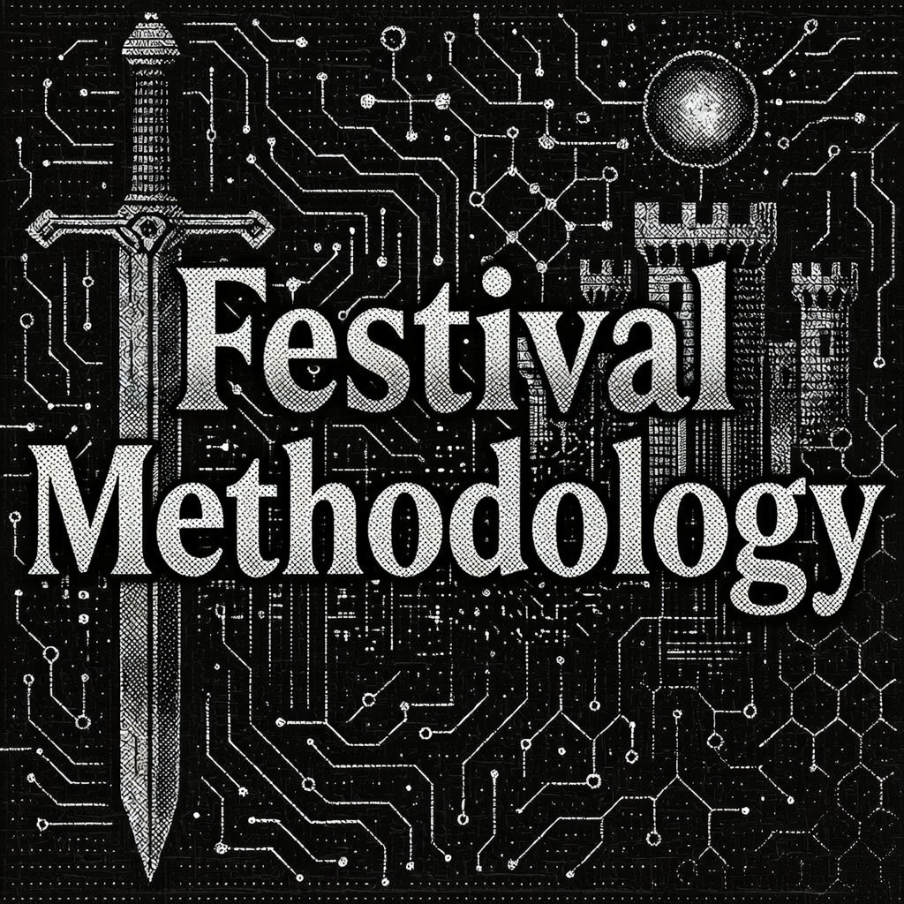
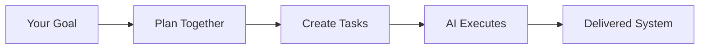

# Festival Methodology

[](LICENSE)
[](fest/LICENSE)
[](CHANGELOG.md)

A goal-based methodology that helps you **collaboratively create actionable tasks** for AI agents to execute in long-running autonomous sessions. Festival transforms high-level objectives into structured, executable work that AI can complete independently.

## What Festival Does

Festival bridges the gap between what you want to build and what AI agents can actually execute:



## Core Benefits

Festival enables:

- **Long-running autonomous builds** - AI agents work for hours or days, not minutes
- **Goal-driven development** - Hierarchical goals with built-in evaluation frameworks
- **Executable specifications** - Every task includes concrete steps AI can follow
- **Context preservation** - Decisions and rationale maintained across sessions
- **Autonomy awareness** - Tasks marked for independent vs collaborative work
- **Parallel execution** - Multiple agents work simultaneously on different parts

## What Makes Festival Different

### 🎯 Hierarchical Goal System

Every level of your project has clear, measurable goals:

- **Festival Goals** - Overall success criteria and KPIs
- **Phase Goals** - Stage-specific objectives that build toward the festival goal
- **Sequence Goals** - Granular targets that ensure phase completion

Each goal includes evaluation frameworks, so you always know if you've succeeded.

### 🧠 Context Preservation

The `CONTEXT.md` file captures:

- Key decisions and rationale
- Session handoff notes
- Open questions for human review
- Lessons learned during execution

This maintains continuity across AI sessions and human reviews.

### 🤖 Autonomy Levels

Every task is marked with an autonomy level:

- **High** - Agent completes independently
- **Medium** - May need edge case clarification
- **Low** - Expect human collaboration

This helps agents know when to proceed vs when to ask for help.

### 📚 Just-In-Time Documentation

Agents read templates and examples only when needed, preserving context window for actual work.

## How It Works: From Goal to Execution

### 1. Define Your Goal

You specify what you want to achieve - a complete feature, system, or product.

### 2. Create Goal Hierarchy

Festival helps structure your goal into measurable objectives at every level.

### 3. Plan with Autonomy Levels

Break down work into tasks, marking which can be done autonomously.

### 4. Execute with Context Tracking

AI agents work independently, documenting decisions in CONTEXT.md.

### 5. Evaluate Against Goals

Review progress using built-in evaluation frameworks.

### 6. Iterate or Complete

Based on goal achievement, refine and continue or mark complete.

## The Three-Level Structure

```text
Goal: Build E-Commerce Platform
├── FESTIVAL_GOAL.md            # Overall success metrics
├── Phase 1: Planning
│   ├── PHASE_GOAL.md           # Planning objectives
│   └── Sequences with goals
├── Phase 2: Design
│   ├── PHASE_GOAL.md           # Design objectives
│   └── Sequences with goals
├── Phase 3: Implementation
│   ├── PHASE_GOAL.md           # Implementation objectives
│   ├── Sequence 1: Backend
│   │   ├── SEQUENCE_GOAL.md    # Backend targets
│   │   ├── Task: User API (autonomy: high)
│   │   ├── Task: Auth Service (autonomy: medium)
│   │   └── Task: Database (autonomy: high)
│   └── Sequence 2: Frontend
│       └── SEQUENCE_GOAL.md    # Frontend targets
└── Phase 4: Validation
    └── PHASE_GOAL.md           # Validation criteria
```

## Creating Actionable Tasks

Festival tasks aren't vague descriptions - they're complete specifications AI can execute:

```markdown
# Task: 01_implement_user_authentication.md

**Autonomy Level:** high # Agent can complete independently

## Objective

Create JWT-based authentication with email/password login

## Requirements

- [ ] User registration endpoint
- [ ] Login with email/password
- [ ] JWT token generation (15min access, 7day refresh)
- [ ] Password hashing with bcrypt
- [ ] Rate limiting (5 attempts/minute)

## Implementation Steps

1. Install dependencies:
   npm install jsonwebtoken bcrypt express-rate-limit

2. Create database schema:
   - users table (id, email, password_hash, created_at)
   - refresh_tokens table (token, user_id, expires_at)

3. Implement endpoints:
   - POST /api/auth/register
   - POST /api/auth/login
   - POST /api/auth/refresh
   - POST /api/auth/logout

## Validation

- Test registration with: curl -X POST localhost:3000/api/auth/register ...
- Verify JWT expiration times
- Check rate limiting blocks after 5 attempts
- Ensure passwords are hashed, not plain text

## Deliverables

- [ ] src/routes/auth.js - Authentication endpoints
- [ ] src/middleware/auth.js - JWT verification
- [ ] src/models/User.js - User model with password hashing
- [ ] tests/auth.test.js - Complete test coverage
```

This level of detail, combined with autonomy levels, enables AI agents to work independently while knowing when to seek help.

## Real-World Usage

Festival Methodology is **actively used and refined through daily development**. It's a living system that evolves based on practical experience:

- Extends autonomous AI coding sessions from hours to multiple days
- Reduces context switching between human and AI work
- Enables complex feature development with minimal supervision
- Particularly effective with tools like Claude Code, Cursor, and Windsurf

### Realistic Expectations

- **Festival gets you 90% there autonomously** - AI agents handle the bulk of implementation
- **Human expertise guides the final 10%** - Your insight ensures quality and correctness
- **Goals evolve as you learn** - Multiple festivals may be needed as requirements clarify
- **Best for complex, multi-day projects** - Not needed for simple, single-task work

## Getting Started

### 1. Verify and Install Festival Structure

```bash
# Clone or copy the festival structure
cp -r festivals/ /your/workspace/
cd /your/workspace/festivals/

# CRITICAL: Agents must verify methodology exists
ls -la .festival/

# Read the agent instructions
cat README.md
```

### 2. Define Your Goal Hierarchy

Create goal documents at each level:

- `FESTIVAL_GOAL.md` - Overall project success criteria
- `PHASE_GOAL.md` - Goals for each phase
- `SEQUENCE_GOAL.md` - Goals for each sequence

### 3. Use Planning Agent

The Festival planning agent helps structure your project:

```bash
# Point AI agent to the planning agent
# It will guide you through structured planning
festivals/.festival/agents/festival_planning_agent.md
```

### 4. Mark Autonomy Levels

As you create tasks, assign autonomy levels:

- Review similar past tasks to gauge complexity
- Start conservative (low autonomy) for unfamiliar work
- Increase autonomy as patterns emerge

### 5. Launch Autonomous Execution

AI agents read tasks and work independently, updating CONTEXT.md with decisions and progress.

### 6. Review and Iterate

Use goal evaluation frameworks to assess progress and determine next steps.

## Festival vs Other Approaches

| Aspect              | Festival                      | Traditional PM | Ad-hoc AI          |
| ------------------- | ----------------------------- | -------------- | ------------------ |
| **Focus**           | Goal achievement via tasks    | Task tracking  | Quick answers      |
| **Task Detail**     | Complete executable specs     | User stories   | Vague prompts      |
| **Execution Time**  | Hours to days                 | Sprint cycles  | Minutes            |
| **Context**         | Persists in CONTEXT.md        | Meeting notes  | Lost between chats |
| **AI Autonomy**     | Guided by autonomy levels     | N/A            | Constant prompting |
| **Collaboration**   | Human-AI task creation        | Human teams    | Human directs      |
| **Success Metrics** | Built-in evaluation framework | Retrospectives | Undefined          |

## Directory Structure

```
festivals/
├── active/                          # Current projects
│   └── auth_system/
│       ├── CONTEXT.md               # Decision tracking & handoff notes
│       ├── FESTIVAL_GOAL.md         # Overall success criteria
│       ├── FESTIVAL_OVERVIEW.md     # Project description
│       ├── 001_PLAN/                # Research & requirements
│       │   ├── PHASE_GOAL.md        # Planning phase objectives
│       │   ├── 01_requirements/     # Requirement gathering
│       │   │   └── SEQUENCE_GOAL.md # Sequence-specific goals
│       │   └── 02_research/         # Technical research
│       │       └── SEQUENCE_GOAL.md
│       ├── 002_DESIGN/              # System design
│       │   ├── PHASE_GOAL.md        # Design phase objectives
│       │   ├── 01_api_design/       # API specifications
│       │   └── 02_data_model/       # Database schema
│       ├── 003_IMPLEMENT/           # Build phase
│       │   ├── PHASE_GOAL.md        # Implementation objectives
│       │   ├── 01_backend/          # Backend tasks
│       │   ├── 02_frontend/         # Frontend tasks
│       │   └── 03_testing/          # Test tasks
│       └── 004_VALIDATE/            # Validation phase
│           └── PHASE_GOAL.md        # Validation criteria
├── planned/                         # Festivals being designed
├── completed/                       # Finished projects
├── dungeon/                         # Archived: paused or cancelled work
└── .festival/                       # Methodology resources
    ├── agents/                      # AI agent prompts
    ├── templates/                   # Document templates
    └── examples/                    # Real-world examples
```

## What's Included

### Templates

- **Goal Templates** - Festival, Phase, and Sequence goal tracking
- **Task Templates** - With autonomy level support
- **Context Template** - For decision and rationale tracking
- **Interface Templates** - For defining system contracts
- **Tracking Templates** - For progress monitoring

### AI Agents

- **Planning Agent** - Guides festival structure creation
- **Review Agent** - Validates methodology compliance
- **Manager Agent** - Enforces process during execution

### Examples & Documentation

- **15+ Real Task Examples** - Showing concrete implementations
- **Goal Examples** - Demonstrating evaluation frameworks
- **Complete Methodology Guide** - Detailed principles and practices

## Why Festival Works

1. **Goals drive everything** - Clear success criteria at every level
2. **Tasks are complete** - No ambiguity, full specifications with autonomy guidance
3. **Context persists** - CONTEXT.md maintains continuity across sessions
4. **Parallel execution** - Multiple agents work simultaneously
5. **Human judgment preserved** - You guide strategy while AI handles implementation
6. **Living methodology** - Continuously refined through real-world use

## Support & Documentation

- **Complete Guide**: `festivals/.festival/FESTIVAL_SOFTWARE_PROJECT_MANAGEMENT.md`
- **Implementation Guide**: `festivals/.festival/README.md`
- **Templates**: `festivals/.festival/templates/`
- **Examples**: `festivals/.festival/examples/`

## Community

- [Issues](../../issues) - Report problems or suggestions
- [Discussions](../../discussions) - Share experiences
- [Contributing](CONTRIBUTING.md) - Help improve the methodology

## License

This repository contains two components with different licenses:

- **Festival Methodology** (documentation, templates, examples) - [MIT License](LICENSE). Use it, adapt it, make it yours.
- **fest CLI** (`fest/` directory) - [Angry Goat License](fest/LICENSE). Source-available for non-commercial use. Commercial licensing available at lance@blockhead.consulting.

---

**The Bottom Line**: Festival Methodology enables AI agents to work autonomously for extended periods on complex projects by providing hierarchical goals, executable task specifications, and context preservation. It's not magic - it's structured collaboration that gets you 90% of the way there autonomously, with human expertise guiding the critical final steps.
