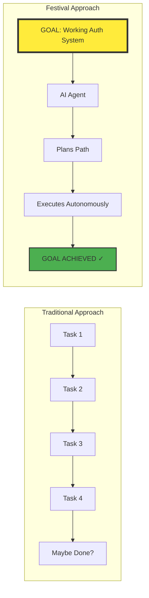
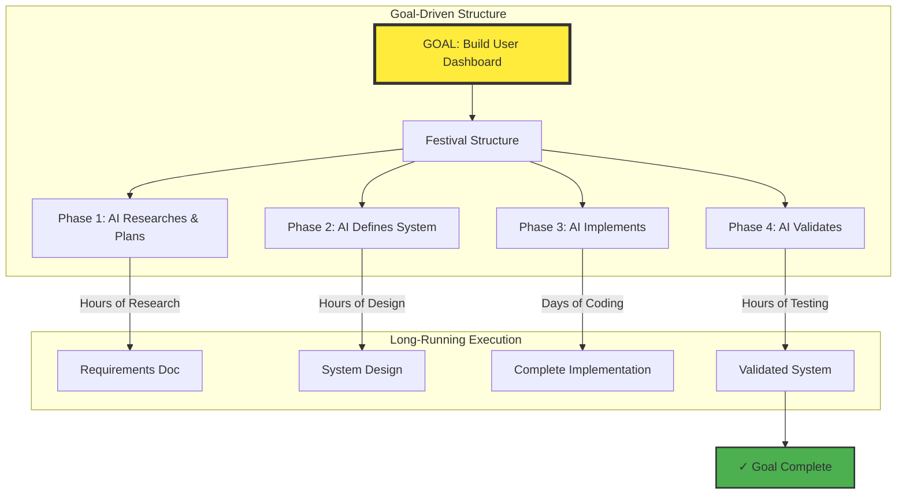
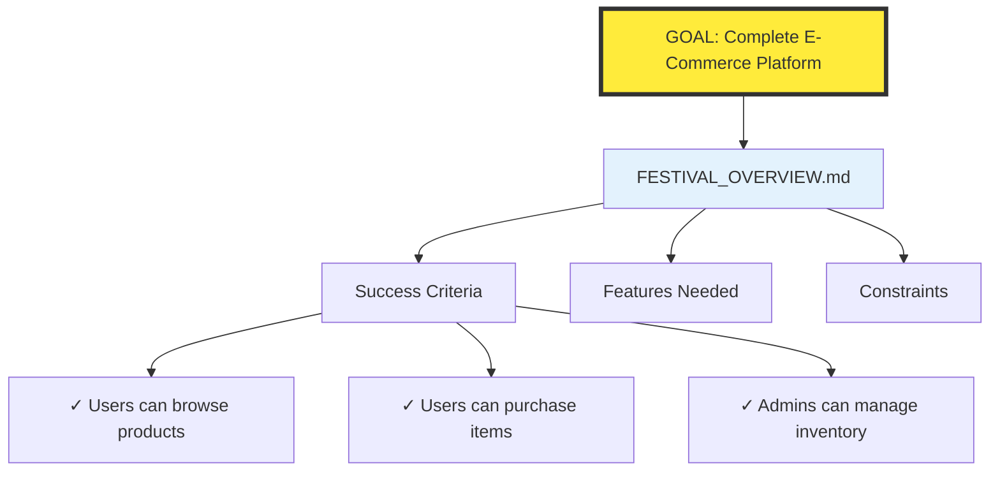
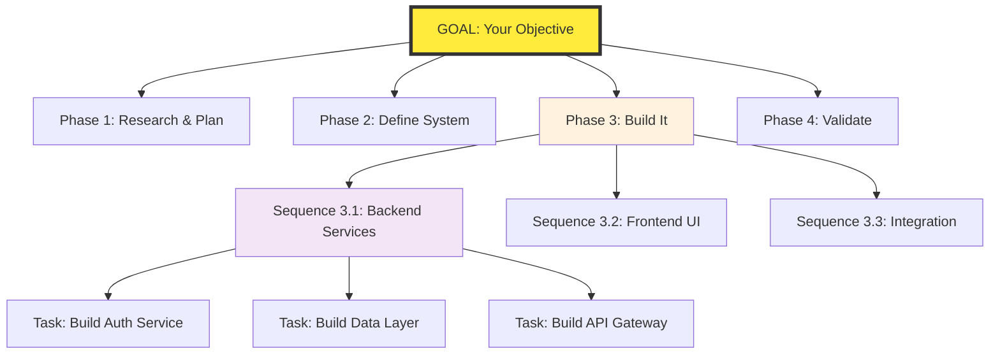
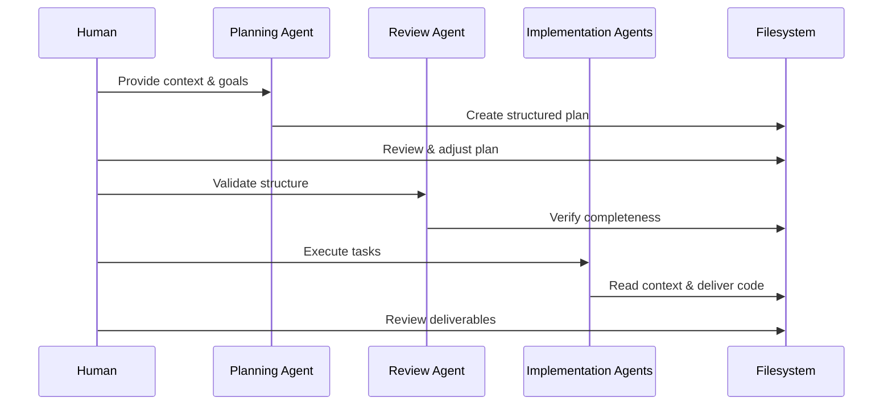

# Festival Methodology

[](https://opensource.org/licenses/MIT)
[](CHANGELOG.md)

A **goal-oriented** project management system designed for **long-running agentic build processes**. Festival enables AI agents to work autonomously for hours or days toward completing meaningful objectives, not just individual tasks.

## The Paradigm Shift: From Tasks to Goals

Traditional methodologies break work into tasks. Festival starts with **goals** and lets AI agents figure out the path to achieve them.



## Enabling Long-Running Agentic Processes

Festival structures projects so AI agents can:
- **Work autonomously for extended periods** - Hours or days, not just single prompts
- **Maintain context across sessions** - Pick up where they left off
- **Self-organize toward goals** - Determine their own path to completion
- **Handle complex, multi-phase projects** - From research through implementation
- **Deliver complete features** - Not just code fragments

## The Core Problems Festival Solves

When you want AI to build something substantial, you hit walls:
- **Goals get lost in implementation details** - Agents lose sight of what they're building
- **Context evaporates between sessions** - Can't run multi-hour builds
- **No structure for autonomous work** - Agents need constant human guidance
- **Plans aren't executable** - Abstract descriptions instead of concrete steps
- **Can't review progress** - No visibility into what the agent is building

Festival provides the **structured foundation** that enables true autonomous AI development.

## How Festival Enables Autonomous AI Development



The key insight: **AI agents can work for hours or days** when given proper structure and clear goals.

## Goal-First Planning: Everything Starts Here



**The Goal drives everything**. Not activities, not tasks, but the concrete outcome you want to achieve.

## The Three-Level Hierarchy for Autonomous Execution



### Why This Enables Long-Running Processes

1. **Goal Persistence** - The goal never gets lost
   - Every task links back to the main objective
   - Agents always know WHY they're building something
   - Success criteria keep work focused

2. **Context Accumulation** - Knowledge builds over time
   - Phase 1 research informs Phase 2 design
   - Phase 2 interfaces guide Phase 3 implementation
   - Nothing gets lost between agent sessions

3. **Autonomous Progress** - Agents work independently
   - Clear sequence dependencies (01_, 02_)
   - Parallel execution within sequences
   - Self-contained tasks with all needed context

## The Planning Phase: Where Context Lives

The Plan phase is where you gather ALL the context your AI agents need:

```
001_PLAN/
├── docs/                           # Documentation you provide
│   ├── existing_api_docs.pdf
│   ├── ui_mockups.png
│   └── meeting_notes.md
├── 01_requirements_gathering/
│   ├── 01_compile_existing_docs.md    # Agent reads your docs
│   ├── 01_research_competitors.md     # Agent uses web search
│   ├── 01_review_legacy_code.md       # Agent examines existing code
│   └── results/
│       ├── requirements_summary.md     # AI-generated summary
│       └── tech_recommendations.md     # AI research results
└── 02_architecture_planning/
    ├── 01_system_design.md
    └── results/
        └── architecture_decisions.md
```

**Key Insight**: The Plan phase creates a persistent knowledge base that future agents can reference efficiently instead of requiring you to re-explain everything.

## How AI Agents Use Festival

### 1. Planning Agent Reads Your Context
```markdown
"Review the documents in 001_PLAN/docs/, search for React component libraries, 
examine the existing codebase at /src/legacy/, then create a requirements summary"
```

### 2. Results Get Organized
The agent saves findings in structured markdown files that become reference material for later phases.

### 3. Human Review and Adjustment
You can easily:
- Review what the agent discovered
- Adjust requirements
- Add missing context
- Reorganize before proceeding

### 4. Implementation Agents Have Everything They Need
```markdown
# Task: 01_create_user_api.md

## Context
Based on requirements in 001_PLAN/01_requirements_gathering/results/api_spec.md

## Objective  
Implement user registration endpoint

## Specifications
[All details from planning phase]

## Implementation Steps
[Concrete steps the agent can execute]
```

## Example: A Real Long-Running Build Process

### The Goal
```markdown
# FESTIVAL_OVERVIEW.md
## Goal
Build a complete user authentication system with OAuth, email verification, and admin panel

## Success Criteria
- [ ] Users can register and login with email/password
- [ ] OAuth integration with Google and GitHub
- [ ] Email verification flow works end-to-end
- [ ] Admin panel shows user metrics and management tools
- [ ] All endpoints have >90% test coverage
```

### Hour 1-3: AI Researches Autonomously
The agent reads existing docs, searches for best practices, examines similar codebases, and produces:
- Comprehensive requirements document
- Technology recommendations
- Security considerations
- Architecture proposal

### Hour 4-6: AI Defines the System
Using research outputs, the agent creates:
- Complete API specifications
- Database schemas
- Component interfaces
- Integration points

### Day 2-3: AI Implements
Multiple agents work in parallel:
- Backend agent builds auth services
- Frontend agent creates UI components
- Testing agent writes comprehensive tests
- DevOps agent sets up deployment

### Day 4: AI Validates
Agents run tests, perform security checks, validate against success criteria, and deliver a **complete, working system**.

**Total Human Involvement**: Review checkpoints and goal adjustment only.

## Festival vs Other Approaches

| Aspect | Festival | APM | Traditional Agile | Ad-hoc AI Chat |
|--------|----------|-----|-------------------|----------------|
| **Core Focus** | **Goal achievement** | Agent coordination | Task completion | Single responses |
| **Process Duration** | **Hours to days** | Per conversation | 2-week sprints | Minutes |
| **AI Autonomy** | **Full autonomous execution** | Guided coordination | N/A | Constant prompting |
| **Context Persistence** | **Accumulates across phases** | In conversation | Meeting notes | Lost immediately |
| **Goal Tracking** | **Built into structure** | Manual | Sprint goals | No goals |
| **Multi-Agent** | **Parallel goal pursuit** | Sequential coordination | Human teams | Single agent |
| **Completion** | **Delivers working systems** | Coordinates tasks | Incremental progress | Fragments |

## Getting Started

### 1. Install the Festival Structure
```bash
cp -r festivals/ /path/to/your/ai-workspace/
```

### 2. Start a New Festival
```
cd festivals/
mkdir active/my_project_festival/
```

### 3. Use the Planning Agent
Point your AI agent to:
- `festivals/.festival/agents/festival_planning_agent.md` - Guides the planning process
- Your existing documentation
- Related code repositories  
- Research sources

The agent will create the structured plan in the filesystem.

### 4. Review and Adjust
Browse the generated structure, adjust requirements, add missing context.

### 5. Execute with Implementation Agents
Each task file contains everything an agent needs to complete it.

## What's Included

### Methodology Documentation
- `FESTIVAL_SOFTWARE_PROJECT_MANAGEMENT.md` - Complete methodology
- `PROJECT_MANAGEMENT_SYSTEM.md` - How to track progress

### Templates for Structure
- `FESTIVAL_OVERVIEW_TEMPLATE.md` - Project goals
- `COMMON_INTERFACES_TEMPLATE.md` - Interface definitions  
- `TASK_TEMPLATE.md` - Task structure
- `FESTIVAL_RULES_TEMPLATE.md` - Project standards

### AI Agent Prompts
- `festival_planning_agent.md` - Conducts planning interviews
- `festival_review_agent.md` - Validates structure
- `festival_methodology_manager.md` - Guides execution

### Examples
- `TASK_EXAMPLES.md` - 15+ task examples
- `FESTIVAL_TODO_EXAMPLE.md` - Progress tracking

## Key Benefits for AI Collaboration

### 1. Context Accumulation
Instead of re-explaining your project to each new agent or chat session, context accumulates in the filesystem structure.

### 2. Clear Handoffs
Each phase produces deliverables that the next phase consumes. No confusion about what's been decided.

### 3. Human Oversight
You can review exactly what the AI is planning before it starts building. Adjust the plan by editing markdown files.

### 4. Parallel Execution
Multiple AI agents can work on different sequences or same-numbered tasks simultaneously.

### 5. Flexible Phases
Adapt phases to your needs:
- Research-heavy project? Add a dedicated research phase
- Migration project? Add a migration phase
- Need security audit? Add an audit phase

## The Festival Workflow



## Why Festival Works for Long-Running AI Builds

Festival succeeds because it:

1. **Maintains goal focus** - Every action traces back to the objective
2. **Enables true autonomy** - AI agents work for hours without intervention
3. **Accumulates knowledge** - Each phase builds on previous work
4. **Supports parallel execution** - Multiple agents pursue the goal simultaneously
5. **Delivers completeness** - Not iterations, but finished, working systems

## Real-World Application

I use Festival daily for **goal-driven development**:
- **Define a goal** (e.g., "Build complete invoice system") and let AI figure out the path
- **Launch multi-day builds** where agents research, plan, and implement autonomously
- **Run parallel agents** pursuing different aspects of the same goal
- **Wake up to completed features**, not half-finished code
- **Achieve meaningful milestones**, not just daily progress

The methodology evolved from wanting AI to truly BUILD things, not just assist with tasks.

## Directory Structure Example

```
festivals/
├── planned/                    # Festivals being designed
├── active/                     # Currently executing
│   └── user_dashboard_festival/
│       ├── FESTIVAL_OVERVIEW.md       # High-level goals
│       ├── FESTIVAL_RULES.md          # Standards to follow
│       ├── 001_PLAN/                  # Gather all context
│       │   ├── docs/                  # Your provided docs
│       │   ├── 01_requirements/       # Requirements analysis
│       │   └── 02_research/           # AI research results
│       ├── 002_DEFINE_INTERFACES/     # Define contracts
│       ├── 003_IMPLEMENT/             # Build it
│       └── 004_REVIEW_AND_UAT/        # Validate
├── completed/                  # Finished festivals
└── archived/                   # Paused work
```

## Support & Documentation

- **Main Documentation**: `festivals/.festival/FESTIVAL_SOFTWARE_PROJECT_MANAGEMENT.md`
- **Implementation Guide**: `festivals/README.md`
- **Templates**: `festivals/.festival/templates/`
- **Examples**: `festivals/.festival/examples/`

## Community

- [Issues](../../issues) - Share what works and what doesn't
- [Discussions](../../discussions) - Methodology improvements
- [Contributing](CONTRIBUTING.md) - Real usage feedback valued most

## License

MIT - Use it, adapt it, make it yours.

---

**The Bottom Line**: Festival Methodology enables **goal-oriented, long-running agentic build processes**. Instead of managing tasks, you define goals and let AI agents work autonomously for hours or days to achieve them. It's the difference between AI as an assistant and AI as a builder.