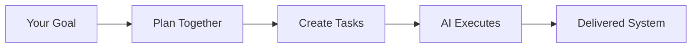

# Festival Methodology

[](https://opensource.org/licenses/MIT)
[](CHANGELOG.md)

A goal-based methodology that helps you **collaboratively create actionable tasks** for AI agents to execute in long-running autonomous sessions. Festival transforms high-level objectives into structured, executable work that AI can complete independently.

## What Festival Does

Festival bridges the gap between what you want to build and what AI agents can actually execute:



## Core Benefits

Festival enables:

- **Long-running autonomous builds** - AI agents work for hours or days, not minutes
- **Collaborative task creation** - You and AI work together to break down goals
- **Executable specifications** - Every task includes concrete steps AI can follow
- **Persistent context** - Knowledge accumulates across work sessions
- **Parallel execution** - Multiple agents work simultaneously on different parts

## How It Works: From Goal to Execution

### 1. Start with a Goal

You define what you want to achieve - a complete feature, system, or product.

### 2. Collaborative Planning

Festival helps you and AI agents break the goal into phases, sequences, and tasks.

### 3. Actionable Task Creation

Each task becomes a detailed specification with:

- Clear objectives
- Concrete implementation steps
- Specific deliverables
- Validation criteria

### 4. Autonomous Execution

AI agents execute tasks independently, maintaining context and building toward the goal.

## The Three-Level Structure

```
Goal: Build E-Commerce Platform
├── Phase 1: Planning
├── Phase 2: Design  
├── Phase 3: Implementation
│   ├── Sequence 1: Backend
│   │   ├── Task: User API
│   │   ├── Task: Auth Service
│   │   └── Task: Database
│   └── Sequence 2: Frontend
└── Phase 4: Validation
```

- **Goal**: The outcome you want to achieve
- **Phases**: Major stages of work (planning, design, implementation, validation)
- **Sequences**: Related tasks that must complete in order
- **Tasks**: Concrete, executable work items with full specifications

## Creating Actionable Tasks

Festival tasks aren't vague descriptions - they're complete specifications AI can execute:

```markdown
# Task: 01_implement_user_authentication.md

## Goal Context

Building authentication for the e-commerce platform to enable user accounts

## Objective

Create JWT-based authentication with email/password login

## Requirements

- [ ] User registration endpoint
- [ ] Login with email/password
- [ ] JWT token generation (15min access, 7day refresh)
- [ ] Password hashing with bcrypt
- [ ] Rate limiting (5 attempts/minute)

## Implementation Steps

1. Install dependencies:
   npm install jsonwebtoken bcrypt express-rate-limit

2. Create database schema:

   - users table (id, email, password_hash, created_at)
   - refresh_tokens table (token, user_id, expires_at)

3. Implement endpoints:

   - POST /api/auth/register
   - POST /api/auth/login
   - POST /api/auth/refresh
   - POST /api/auth/logout

4. Add middleware:
   - Authentication verification
   - Rate limiting
   - Input validation

## Validation

- Test registration with: curl -X POST localhost:3000/api/auth/register ...
- Verify JWT expiration times
- Check rate limiting blocks after 5 attempts
- Ensure passwords are hashed, not plain text

## Deliverables

- [ ] src/routes/auth.js - Authentication endpoints
- [ ] src/middleware/auth.js - JWT verification
- [ ] src/models/User.js - User model with password hashing
- [ ] tests/auth.test.js - Complete test coverage
```

This level of detail enables AI agents to work autonomously without constant clarification.

## Long-Running Autonomous Execution

```
Hour 0-4:    Research Phase (Complete)
Hour 4-10:   Design Phase (Active)  
Hour 10-22:  Build Phase (8-12 hours of parallel work)
Hour 22-25:  Validation Phase
```

AI agents work continuously, moving through phases autonomously while you review at checkpoints.

## The Collaborative Process

```
1. You define goal → Festival suggests structure
2. You refine plan → AI generates detailed tasks  
3. Tasks saved to filesystem → You review and adjust
4. AI executes autonomously → Delivers results
5. You validate completion
```

## Getting Started

### 1. Install Festival Structure

```bash
cp -r festivals/ /your/workspace/
cd /your/workspace/festivals/
```

### 2. Define Your Goal

Create `FESTIVAL_OVERVIEW.md` with:

- Clear objective
- Success criteria
- Constraints
- Key features

### 3. Use Planning Agent

The Festival planning agent helps structure your project:

```bash
# Point AI to the planning agent
festivals/.festival/agents/festival_planning_agent.md
```

### 4. Collaborate on Task Creation

Work with AI to create detailed, actionable tasks in the filesystem structure.

### 5. Launch Autonomous Execution

AI agents read tasks and work independently to achieve the goal.

## Festival vs Other Approaches

| Aspect             | Festival                   | Traditional PM | Ad-hoc AI          |
| ------------------ | -------------------------- | -------------- | ------------------ |
| **Focus**          | Goal achievement via tasks | Task tracking  | Quick answers      |
| **Task Detail**    | Complete executable specs  | User stories   | Vague prompts      |
| **Execution Time** | Hours to days              | Sprint cycles  | Minutes            |
| **Context**        | Persists in filesystem     | Meeting notes  | Lost between chats |
| **AI Autonomy**    | Full autonomous execution  | N/A            | Constant prompting |
| **Collaboration**  | Human-AI task creation     | Human teams    | Human directs      |

## Directory Structure

```
festivals/
├── active/                     # Current projects
│   └── auth_system/
│       ├── FESTIVAL_OVERVIEW.md       # Goal & success criteria
│       ├── 001_PLAN/                  # Research & requirements
│       │   ├── 01_requirements/       # Requirement gathering
│       │   └── 02_research/           # Technical research
│       ├── 002_DESIGN/                # System design
│       │   ├── 01_api_design/         # API specifications
│       │   └── 02_data_model/         # Database schema
│       ├── 003_IMPLEMENT/             # Build phase
│       │   ├── 01_backend/            # Backend tasks
│       │   ├── 02_frontend/           # Frontend tasks
│       │   └── 03_testing/            # Test tasks
│       └── 004_VALIDATE/              # Validation phase
├── completed/                  # Finished projects
└── .festival/                  # Methodology resources
    ├── agents/                 # AI agent prompts
    ├── templates/              # Task templates
    └── examples/               # Example tasks
```

## What's Included

- **Planning Agents** - AI prompts for structuring projects
- **Task Templates** - Formats for creating executable tasks
- **Real Examples** - 15+ examples of well-written tasks
- **Methodology Guide** - Complete documentation

## Why Festival Works

1. **Goals drive structure** - Everything traces back to the objective
2. **Tasks are complete** - No ambiguity, full specifications
3. **Context persists** - Information accumulates across sessions
4. **Parallel execution** - Multiple agents work simultaneously
5. **Human oversight** - Review and adjust at natural checkpoints

## Support & Documentation

- **Complete Guide**: `festivals/.festival/FESTIVAL_SOFTWARE_PROJECT_MANAGEMENT.md`
- **Templates**: `festivals/.festival/templates/`
- **Examples**: `festivals/.festival/examples/`

## Community

- [Issues](../../issues) - Report problems or suggestions
- [Discussions](../../discussions) - Share experiences
- [Contributing](CONTRIBUTING.md) - Help improve the methodology

## License

MIT - Use it, adapt it, make it yours.

---

**The Bottom Line**: Festival Methodology helps you collaboratively create actionable tasks from goals, enabling AI agents to work autonomously for extended periods and deliver complete, working systems.

